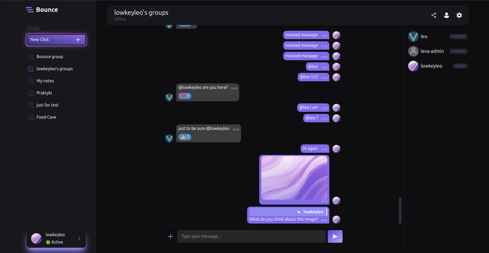
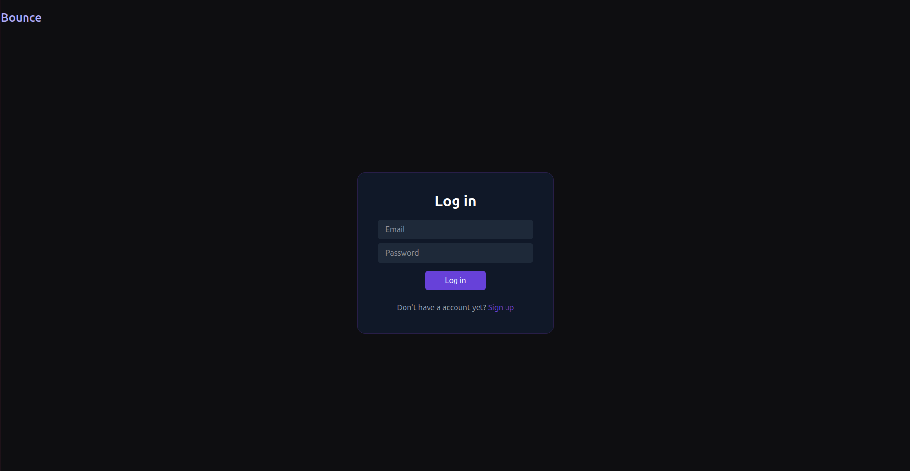
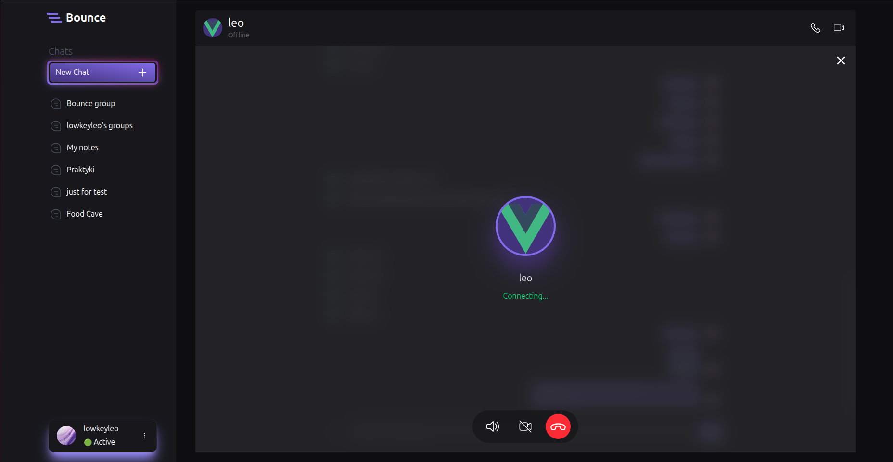

# Bounce

A real-time communication platform for communities, teams, and friends.
YourAppName provides persistent chat servers, channels, voice communication, and rich messaging, similar to Telegram.

---

## 🌟 Features

#### Messaging

- Real-time text messaging
- Markdown formatting
- Emoji reactions
- Message deletion
- File attachments and media previews

#### Groups

- Creating group
- Joining group
- Group deletion
- User restrictions

#### User System

- Avatars
- Presence status (online/offline/idle)

#### Voice Communication

- Low-latency voice chat
- Mute and deafen controls

#### Internal notifications

- Mentions (@user)
- DM messages

## Screenshots



<p align="center">
    
    
</p>

## ✨ Tech Stack

#### Client

- Vue.js + TS
- Pinia
- Vue router
- Iconify
- Tailwind CSS
- Socket.io client
- Axios
- Storybook
- **Testing:**
    - Vitest (unit / component)
    - Playwright (e2e)
    - Vue Test Utils
    - jsdom

#### Server:

- Express
- Cloudinary
- Socket.io
- Nodemailer
- Express validator
- JWT

#### Real-Time Communication

- WebRTC (voice communication)
- STUN/TURN servers for NAT traversal

#### Database:

- MySQL
- Redis

## 💡 Architecture

Project follows custom Feature-Sliced Design architecture

```
src/
 ├─ app/ # Router, providers, etc.
 │   ├─ layouts/
 │   ├─ router/
 │   └─ App.vue
 │
 ├─ pages/ # Represents different views
 │   ├─ chat/
 │   ├─ login/
 │   ├─ landind/
 │   └─ settings/
 │
 ├─ widgets/ # Combines entities and features
 │   ├─ sidebar/
 │   └─ chat-top-bar/
 |
 ├─ features/ # What user can do
 │   ├─ ban-member/
 │   ├─ leave-group/
 │   |─ delete-message/
 |   └─ show-ban-reason/
 |
 ├─ shared/ # Shared data (configs, ui, etc.)
 │   ├─ config/
 │   ├─ lib/
 │   └─ ui/
```

## ⚡️ Installation

1. Clone the repository

```bash
  git clone https://github.com/karal63/Bounce.git bounce && cd bounce
```

2. Install dependencies

```bash
  npm install
```

3. Configure environment variables

Rename .env.example file to .env and fill it with your data:

```
SERVER_HOST=http://localhost:5000
CLIENT_HOST=http://localhost:5173
PORT=5000

DB_HOST=localhost
DB_USER=root
DB_NAME=bounce
DB_PASSWORD=

ACCESS_TOKEN=your_secure_access_token
REFRESH_TOKEN=your_secure_refresh_token
REDIS_USERNAME=default
REDIS_PASSWORD=
REDIS_HOST=127.0.0.1
REDIS_PORT=6379

SMTP_HOST=smtp.gmail.com
SMTP_PORT=
SMTP_USER=
SMTP_PASSWORD=

CLOUDINARY_CLOUD_NAME=
CLOUDINARY_API_KEY=
CLOUDINARY_API_SECRET=
```

4. Start the development server

```bash
npm run dev
```

## ⚙️ Running Tests

To run tests, run the following command

```bash
npm run test
```

## 📍 Roadmap

Planned features:

- Screen sharing

- Bots & integrations

## 👤 Project Objectives

This project was developed to demonstrate:

- Proficiency in UI component isolation and development using Storybook

- Implementation of comprehensive testing strategies across multiple testing layers

- Practical use of peer-to-peer media communication with WebRTC

- Real-time messaging using WebSocket connections

- Integration of in-memory data storage with Redis

- Email delivery integration using the Simple Mail Transfer Protocol (SMTP)

- Application of modern web application architecture patterns

- Designing and implementing a scalable and maintainable project structure
